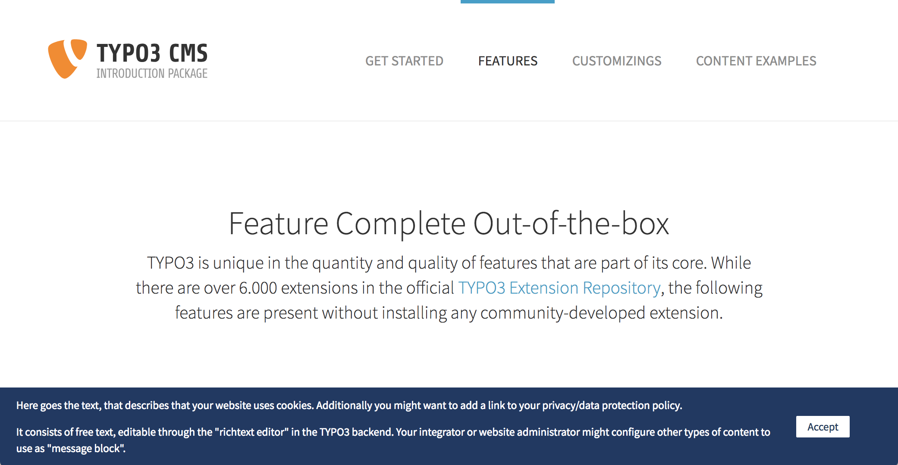

.. include:: ../Includes.txt

.. _section-introduction:

Introduction
============

.. _section-what-it-does:

What does it do?
----------------

This extension provides lots of possibilities to hide and show contents
based on the existence or values of cookies. On board is a frontend
plugin to display "cookie-banners" as well as a configurable API to
manage cookies for PHP, JavaScript and CSS.

**Features**

1. Frontend plugin to display "cookie-banners". It shows a message as long
   as the message is not aknowledged (by clicking the accept-button).

2. An API for PHP and JavaScript to manage cookies. A "CSS-API" to show
   and hide contents by just using CSS classes (based on the existence
   or absence of a cookie).
3. A convenient backend module to give backend users the possiblity to
   manage the cookie-banner contents as well as some configuration
   options.
4. Lots of configuration possibilities.
5. Wish/need more? Get in touch: https://github.com/aaw-team/fe_cookies

Screenshots
-----------

   Cookie banner plugin preview

.. _section-credits:

Credits
-------

Thanks to the `Agentur am Wasser <https://www.agenturamwasser.ch/>`_, our
company, for giving us the possibility to realize this extension and
share it with the TYPO3 community.
