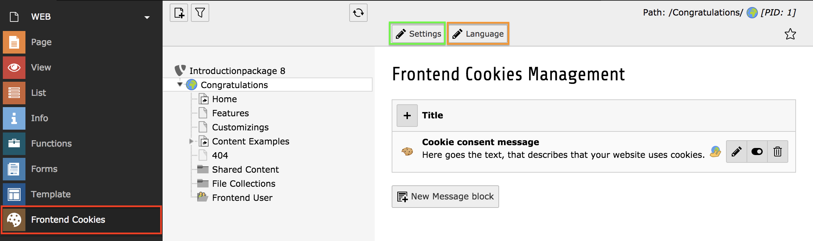

.. include:: ../Includes.txt

.. _section-user:

User
====

.. contents:: Table of Contents
    :local:

.. _section-user-backendmodule:

The backend module
------------------

The backend module provides you a convenient way to manage the messages
and (if enabled) the settings of the "cookie-banner". This banner has to
be enabled by your integrator or website administrator, ask him for
further explanations.

The backend module can be reached by clicking on the "Frontend Cookies"
module from the module list (see the red mark in the following picture):

   Backend module overview

.. _section-user-editmessageblockrecords:

Edit Message block records
--------------------------

The default view of the backend module shows you the so called "message
block" records. These will be shown within the frontend plugin, dependent
on the access settings, which you can define per record.

You can:

   * Create new records
   * Edit existing records
   * Hide/unhide records
   * Move records up/down in the list (if there is more than one)
   * Delete records

.. tip::
   
   The "message block" records can exist on any page in the page tree,
   you have to select the correct page in advance. In a normal scenario
   this will be the root page of your website. Your integrator will
   inform you, which page you have to select.

.. _section-user-editsettings:

Edit settings
-------------

If you have the permission to do so, you can open the settings for the
frontend plugin. It can be accessed through the link inside the
"toolbar", which is located right above the content-editing area (see the
**green mark** in the :ref:`picture above <section-user-backendmodule>`).
If you cannot see the link, you are not allowed to edit the settings.

   Default settings overview

.. tip::

   It is possible, that you don't see exactly the same settings as in the
   picture. The options you're allowed to edit are defined by your
   integrator.

Edit language labels
--------------------

If you have the permission to do so, you can open the management of the
language labels, which will be used in the frontend plugin. It can be
accessed through the link inside the "toolbar", which is located right
above the content-editing area (see **orange mark** in the
:ref:`picture above <section-user-backendmodule>`). If you cannot see
the button, you are not allowed to edit the language labels.

   Language labels management overview

.. tip::

   It is very likely, that you don't see the same languages as in the
   picture. The languages you're allowed to edit are defined by your
   integrator (and by the requirements of your website as well).
